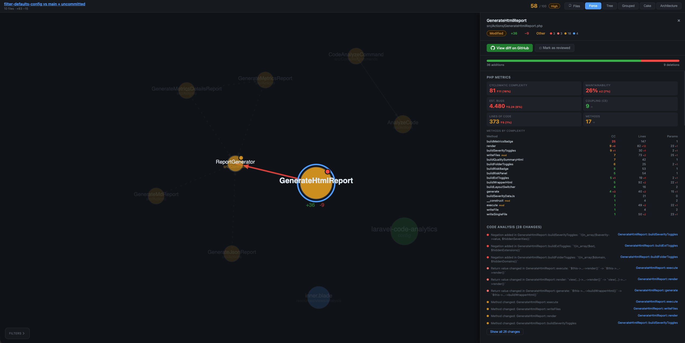
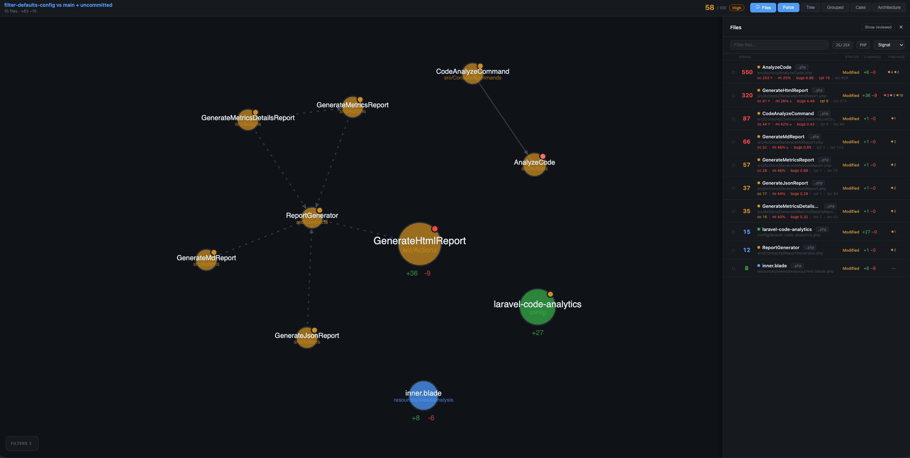

# Laravel Code Analytics
Laravel Code Analytics is a powerful tool designed to provide insights into your codebase by analyzing changes, dependencies, and architectural patterns. It helps maintain code health through risk scoring, metric tracking, and visual representations of your application structure.

Example of a report here: [https://vistik.github.io/laravel-code-analytics/pr-78.html](https://vistik.github.io/laravel-code-analytics/pr-78.html)

## Features
- **Code Change Analysis:** Analyze git diffs to identify high-risk changes.
- **Architectural Visualization:** Generate visual reports (Force Graph, Layered Cake, etc.) to understand your application structure.
- **Metric Tracking:** Track cyclomatic complexity, logical lines of code, and parameter counts.
- **Customizable Rules:** Define specific rules for your project's architecture and requirements.

## Installation

You can install the package via composer:

```bash
composer require vistik/laravel-code-analytics
```

You can publish and run the migrations with:

You can publish the config file with:

```bash
php artisan vendor:publish --tag="laravel-code-analytics-config"
```

## Usage

Analyze your code by running the `code:analyze` Artisan command:

```bash
php artisan code:analyze
```

### Arguments and Options

| Argument/Option | Description |
| :--- | :--- |
| `repo-path` | Path to the local git repo (defaults to current working directory) |
| `output` | Output file path (HTML, Markdown, or JSON depending on --format) |
| `--base` | Base branch or commit to diff against (default: `main`). Use `HEAD` to see only uncommitted changes |
| `--pr` | GitHub PR URL to analyze remotely (e.g. https://github.com/owner/repo/pull/123) |
| `--all` | Analyze all tracked files instead of just the diff |
| `--title` | Custom title for the analysis report |
| `--view` | Default graph view to show (force, tree, grouped, cake, arch) |
| `--config` | Path to a JSON config file |
| `--format` | Output format: `html`, `md`, `json`, `metrics`, or `metrics-details` (default: `html`) |
| `--min-severity` | Minimum severity to include (info, low, medium, high, very_high) |
| `--file` | Only analyze files matching this path or glob pattern (can be repeated) |
| `--open` | Open the generated file in the browser when done |
| `--full-files` | Embed full file contents in the report (increases report size) |

Example:

```bash
php artisan code:analyze --format=html --min-severity=medium --open
```


## Testing

```bash
composer test
```

## Screenshots




## Changelog

Please see [CHANGELOG](CHANGELOG.md) for more information on what has changed recently.

## Contributing

Please see [CONTRIBUTING](CONTRIBUTING.md) for details.

## Security Vulnerabilities

Please review [our security policy](../../security/policy) on how to report security vulnerabilities.

## Credits

- [Visti Kløft](https://github.com/vistik)
- [All Contributors](../../contributors)

## License

The MIT License (MIT). Please see [License File](LICENSE.md) for more information.
